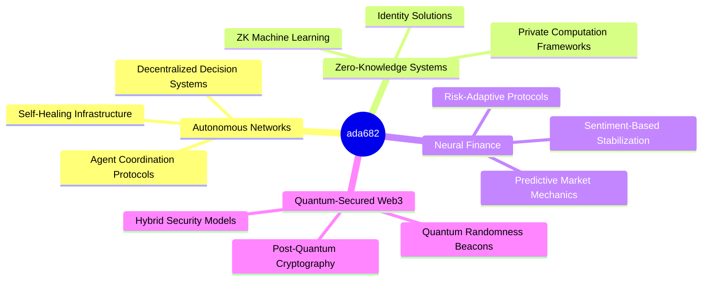

# [ada682] <span style="color:#0AEFFF">∞</span> NEURAL ARCHITECT

<div align="center">
  
  
  <div style="margin-top:15px">
    <a href="https://t.me/Realsonnet">
      
    </a>
    <a href="mailto:nandabahari20@gmail.com">
      
    </a>
    <a href="https://ada682.eth">
      
    </a>
  </div>
  
  
</div>

## `> ENTITY.IDENTIFY()`

```typescript
interface NeuralArchitect {
  specializations: string[];
  coreLanguages: {[key: string]: number};
  protocols: string[];
  aiSystems: string[];
  vision: string;
}

const ada682: NeuralArchitect = {
  specializations: [
    "Autonomous Agent Networks", 
    "ZK Computation Frameworks", 
    "Quantum-Resistant Protocols", 
    "NeuroSymbolic Systems"
  ],
  coreLanguages: {
    "Rust": 0.92,
    "TypeScript": 0.87,
    "Python": 0.89,
    "Solidity": 0.85,
    "Vyper": 0.78
  },
  protocols: [
    "EVM Compatible L2s", 
    "zkSync", 
    "StarkNet", 
    "Arbitrum", 
    "Optimism"
  ],
  aiSystems: [
    "Autonomous Market Agents",
    "Multi-Agent Architectures",
    "LLM-Enhanced Smart Contracts",
    "Neural Oracle Networks"
  ],
  vision: "Forging the convergence of neural networks and decentralized protocols to create self-evolving digital ecosystems"
}
```

## `> CAPABILITIES.MATRIX()`

| Domain | Proficiency | Focus Areas |
|--------|------------|-------------|
|  | ████████░░ | Multi-agent systems, Neural oracles, LLM-enhanced protocols |
|  | █████████░ | Layer 2 scaling, Cross-chain bridges, MEV protection |
|  | ████████░░ | ZK proofs, Post-quantum schemes, Threshold signatures |
|  | █████████░ | Automated market makers, Yield optimization, Risk models |

## `> METRICS.QUANTIFY()`

<div align="center">
  
  
</div>

## `> TECH.STACK.VISUALIZE()`

<div align="center">
  <div>
    
    
    
    
    
  </div>
  <div>
    
    
    
    
    
  </div>
  <div>
    
    
    
    
  </div>
</div>

## `> PROJECTS.SHOWCASE()`

<div align="center">
  <a href="https://github.com/ada682/just-for-verify">
    
  </a>
</div>

## `> RESEARCH.FOCUS()`



## `> DIMENSIONAL.ANALYSIS()`

<div align="center">
  
</div>

## `> COLLABORATION.INITIALIZE()`

<div style="background: linear-gradient(90deg, rgba(10,239,255,0.1) 0%, rgba(10,239,255,0.3) 100%); padding: 20px; border-radius: 10px; margin: 20px 0;">

### NETWORK EXPANSION PROTOCOLS

- 🔮 **Future-Proof Protocol Design** — Building systems resistant to quantum and AI-based attacks
- 🌐 **Cross-Chain Intelligence** — Implementing neural bridges between isolated blockchain ecosystems
- 🛡️ **Zero-Knowledge Privacy Layer** — Developing computation frameworks with mathematical privacy guarantees

</div>

### CONNECTION 

- 📱 **Telegram** — [@Realsonnet](https://t.me/Realsonnet)
- 📧 **Email** — nandabahari20@gmail.com
- 🔷 **ENS** — `ada682.eth`

## `> INSIGHT()`

The intersection of quantum computing and neural networks is creating a new paradigm for blockchain security. By 2026, quantum-resistant cryptographic protocols integrated with neural verification systems will enable a new generation of ultra-secure, self-adapting blockchain architectures that can detect and neutralize advanced quantum attacks before they materialize.

---

<div align="center">
  
</div>
