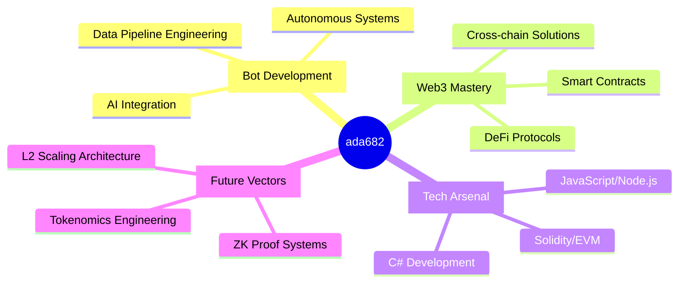

<div align="center">
  
# [ada682]


[](https://t.me/Realsonnet)
[](mailto:nandabahari20@gmail.com)

</div>

<div align="center">
  
</div>

---

## ⚡ Neural Interface



## 🌌

<table>
  <tr>
    <td width="50%">
      
    </td>
    <td width="50%">
      
    </td>
  </tr>
</table>

## 🔮 Tech 

<div align="center">
  


  
</div>

## ⚙️ Runtime 

<div align="center">

```javascript
class Developer {
  constructor() {
    this.name = "ada682";
    this.role = "Bot Architect & Web3 Pioneer";
    this.languageSpoken = ["en", "code"];
    this.currentFocus = "Creating intelligent systems for decentralized networks";
  }
  
  async developSolution(challenge) {
    const analysis = await this.analyzeRequirements(challenge);
    const architecture = this.designArchitecture(analysis);
    const implementation = await this.implementSolution(architecture);
    
    return this.deployToProduction(implementation);
  }
  
  get availability() {
    return {
      collaborations: true,
      contractWork: true,
      recruiters: this.match_requirements ? true : false
    };
  }
}
```

</div>

## 🚀 Trajectory 

- 🔭 Architecting next-generation autonomous bot networks with cross-chain capabilities
- 🧠 Developing neural interfaces between traditional systems and decentralized protocols
- 🌐 Pioneering zero-trust architectures for Web3 applications with enhanced privacy mechanics
- ⚡ Implementing quantum-resistant cryptography in distributed systems

<div align="center">
  
</div>

<div align="center">
  
  
  
  > "The code of tomorrow is written in the syntax of today. The future is just a runtime away."
  
</div>


