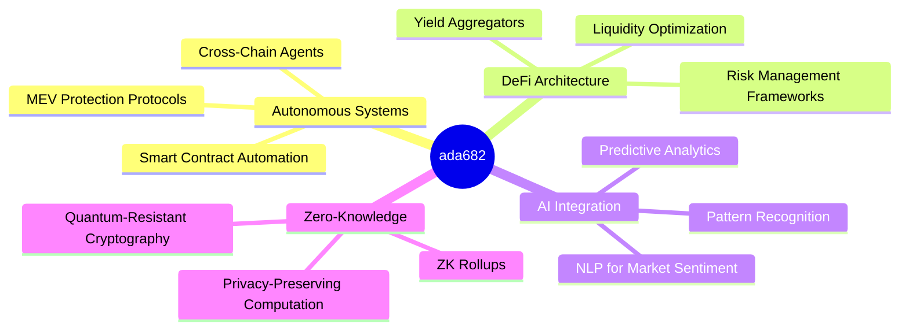

# Hello, I'm [ada682] 👾

<div align="center">
  
  
  <a href="https://t.me/Realsonnet">
    
  </a>
  <a href="mailto:nandabahari20@gmail.com">
    
  </a>
  
  
</div>

## `> SYSTEM.INFO()`

```typescript
interface Developer {
  core: string[];
  languages: string[];
  stack: string[];
  mission: string;
}

const ada682: Developer = {
  core: ["AI Systems", "DeFi Architecture", "Autonomous Agents", "Trading Algorithms"],
  languages: ["JavaScript/TypeScript", "Python", "C#", "Solidity", "Rust"],
  stack: ["Node.js", "React", "Docker", "Web3.js/Ethers.js", "FastAPI", "TensorFlow"],
  mission: "Architecting the nexus between autonomous systems and decentralized networks"
}
```

## `> CORE.CAPABILITIES()`

- 🤖 **Advanced Bot Engineering** — Building autonomous systems with machine learning integration
- ⛓️ **Web3 Infrastructure** — Designing resilient blockchain architecture and cross-chain solutions
- 🧠 **AI-Enhanced Analytics** — Leveraging neural networks for market pattern recognition
- 🔐 **Zero-Knowledge Systems** — Implementing privacy-preserving computation frameworks

## `> METRICS.VISUALIZE()`

<div align="center">
  
  
</div>

## `> TECH.STACK()`

<div align="center">
  
</div>

## `> PROJECTS.FEATURED()`

<div align="center">
  <a href="https://github.com/ada682/just-for-verify">
    
  </a>
</div>

## `> CURRENT.FOCUS()`



## `> CONNECT.INIT()`

- 💼 **Collaboration** — Open to pioneering projects at the frontier of Web3 and AI
- 📱 **Telegram** — [@Realsonnet](https://t.me/Realsonnet)
- 📧 **Email** — nandabahari20@gmail.com
- 🌐 **Web3** — `ada682.eth`

## `> FACTOID.RANDOM()`

The quantum computing threat to current blockchain cryptography is driving development of post-quantum cryptographic algorithms. The first quantum-resistant blockchain protocols are expected to reach production by 2026, marking a new era of cryptographic security.

---

<div align="center">
  
  <br><br>
  
</div>
